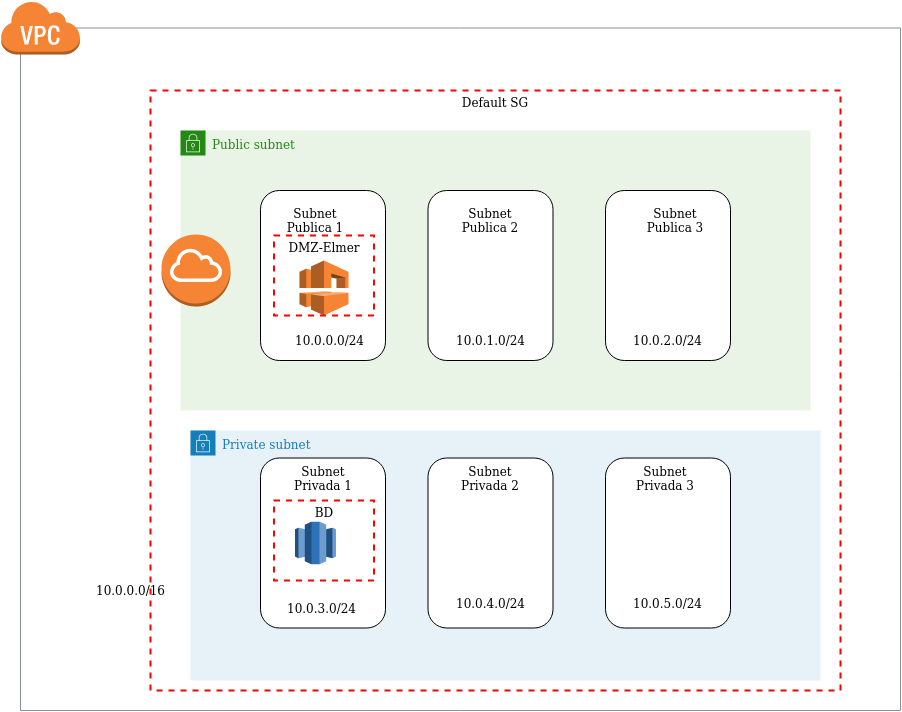

# Trambo-CloudFormation
February 24, 2020. Create VPC using CloudFormation

Exercise 5 (Cloudformation):
This exercise consists in configure and start a MySQL database and a wordpress server using a EC2 instance.
The templates are classified depending their kind (there is more detailed information about each template in their respective folder).

1. [Network](/Network)
    In the nework.yml file were created all the resources needed for the VPC.
2. [Base de Datos](/BaseDatos)
    In the bd.yml file were created the RDS instance and were configure in order to works with the VPC created.
3. [Instancias](/Instancias)
    In the wordpress.yml file were created the EC2 instance and all the resources needed for the instance.

The complete diagrama is the following:


# principal.yml
The file [principal](/principal.yml) is in charge of calls all the others templates and manage the parameters and outputs, works like a bridge because can take a ouptup of a specific template and can send as input for another one. This file is structures as following:

- Description

    Is a string that describes the template
- Resources

    This block indicates which resources will be used and calls another templates.
    - NetworkStack

            In this case we just create one object of the network template because we only need one VPC.
            ```

            NetworkStack: 
                Type: AWS::CloudFormation::Stack
                Properties: 
                TemplateURL: "https://trambo-elmer.s3-us-west-2.amazonaws.com/CloudFormation/Network/network.yml"
            
            ```
    - BDStack

        This block creates a RDS object and pass as string parameter all the privates subnets, separates by a comma, and sends the security group, that just have the 3306 port open, and the VPC default security group.

        ```
        BDStack: 
            Type: AWS::CloudFormation::Stack
            Properties: 
            TemplateURL: "https://trambo-elmer.s3-us-west-2.amazonaws.com/CloudFormation/BaseDatos/bd.yml"
            Parameters:
                RefSubnetsPrivadas: !GetAtt NetworkStack.Outputs.RefSubnetsPrivadas
                RefSG : !GetAtt NetworkStack.Outputs.RefSGBD
                RefDefaultSG : !GetAtt NetworkStack.Outputs.RefDefaultSG

        ```
    - WordpressStack

        This block creates a object of wordpress template, we send as parameter the public subnet id, where it will be executing, and the security group (which have the port 80 and  22 open), the RDS endpoint and the default security group of the VPC.

        ```
          WordpressStack: 
            Type: AWS::CloudFormation::Stack
            Properties: 
            TemplateURL: "https://trambo-elmer.s3-us-west-2.amazonaws.com/CloudFormation/Instancias/wordpress.yml"
            Parameters:
                RefSubnetPublica: !GetAtt NetworkStack.Outputs.RefSubnetPublic1
                RefSG : !GetAtt NetworkStack.Outputs.RefSG
                EndpointBD: !GetAtt BDStack.Outputs.EndpointBD
                RefDefaultSG : !GetAtt NetworkStack.Outputs.RefDefaultSG
        ```